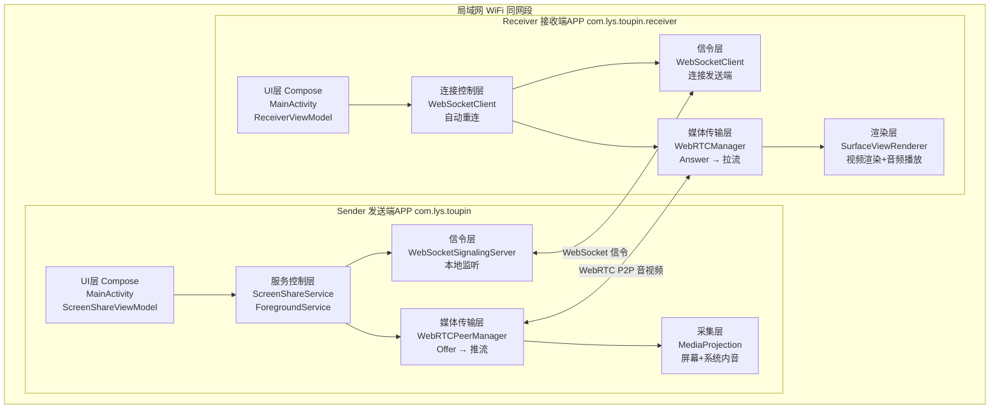
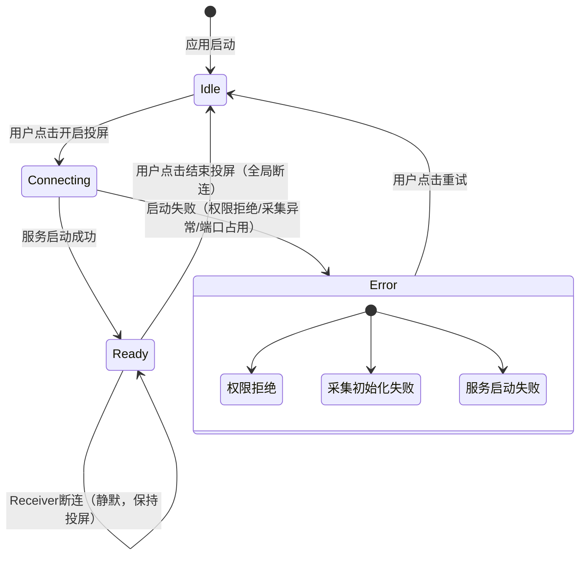
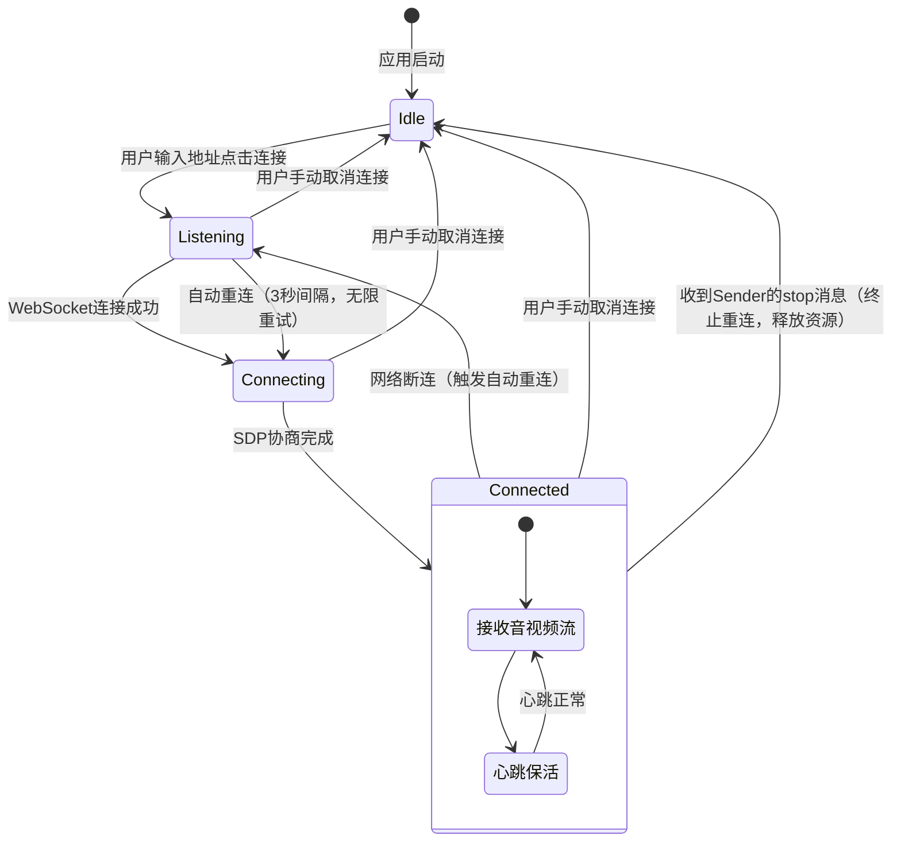
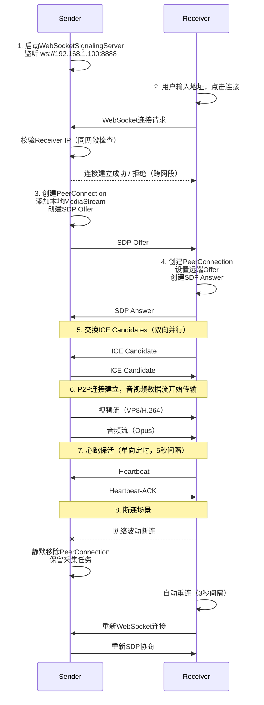
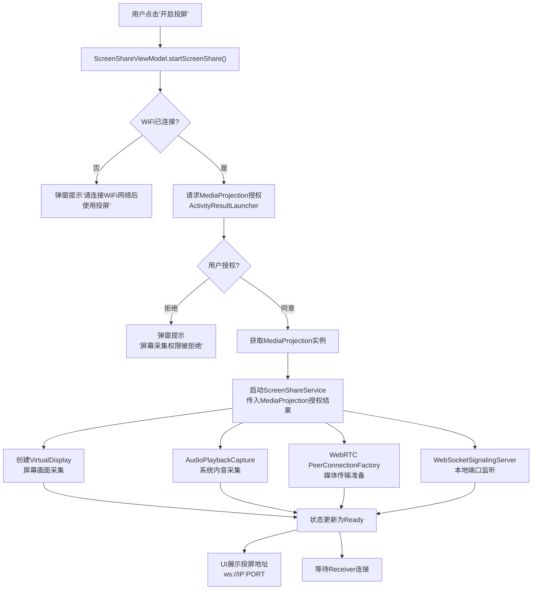

# Android投屏发送端MVP技术方案文档

## 一、文档概述

### 1.1 文档目的

本文档基于《Android投屏发送端MVP产品与技术方案》需求文档，对投屏发送端MVP版本进行详细的技术方案设计，明确技术选型、模块划分、接口定义、数据流转、异常处理等实现细节，指导开发落地。

### 1.2 读者对象

Android开发工程师、技术负责人、测试工程师

### 1.3 术语定义

| 术语              | 说明                                                  |
| --------------- | --------------------------------------------------- |
| Sender          | 投屏发送端APP，负责屏幕/音频采集与推流                               |
| Receiver        | 投屏接收端APP，负责接收并渲染音视频流                                |
| WebRTC          | 点对点实时通信框架，用于音视频传输                                   |
| SDP             | Session Description Protocol，WebRTC会话描述协议           |
| ICE             | Interactive Connectivity Establishment，WebRTC连接建立协议 |
| MediaProjection | Android系统级屏幕采集API                                   |
| Signaling       | 信令，用于WebRTC连接建立前的协商通信                               |

***

## 二、整体技术架构

### 2.1 架构总览

采用 **移动端P2P点对点直连架构**，无中心化服务，Sender集成WebSocket信令服务端+WebRTC媒体发送端能力，Receiver作为WebSocket信令客户端+WebRTC媒体接收端主动接入。



### 2.2 技术选型

| 技术领域   | 选型                                   | 版本           | 选型理由                       |
| ------ | ------------------------------------ | ------------ | -------------------------- |
| 开发语言   | Kotlin                               | -            | 官方推荐语言，协程支持优秀              |
| UI框架   | Jetpack Compose                      | BOM 2024.01+ | 声明式UI，代码简洁高效               |
| WebRTC | Stream WebRTC Android                | 1.3.10       | 封装Google WebRTC，API友好，稳定可靠 |
| 信令协议   | WebSocket                            | -            | 全双工通信，适合实时信令交换             |
| 屏幕采集   | MediaProjection API                  | Android 10+  | 系统级屏幕采集，无需Root             |
| 音频采集   | MediaProjection AudioPlaybackCapture | Android 10+  | 系统级内部音频采集，天然屏蔽麦克风          |
| 构建系统   | Gradle                               | 8.13         | Android标准构建工具              |
| 最低SDK  | API 26 (Sender) / API 24 (Receiver)  | -            | 覆盖主流机型                     |
| 目标SDK  | API 36                               | -            | 适配最新系统特性                   |

### 2.3 核心依赖清单

**Sender模块：**

```groovy
dependencies {
    // WebRTC
    implementation("io.getstream:stream-webrtc-android:1.3.10")

    // Compose
    implementation(platform("androidx.compose:compose-bom:2024.01.00"))
    implementation("androidx.compose.material3:material3")
    implementation("androidx.compose.ui:ui")
    implementation("androidx.compose.ui:ui-tooling-preview")
    implementation("androidx.activity:activity-compose:1.9.0")

    // Lifecycle
    implementation("androidx.lifecycle:lifecycle-viewmodel-compose:2.7.0")
    implementation("androidx.lifecycle:lifecycle-runtime-compose:2.7.0")

    // Material
    implementation("com.google.android.material:material:1.13.0")
}
```

**Receiver模块：**

```groovy
dependencies {
    // WebRTC
    implementation("io.getstream:stream-webrtc-android:1.3.10")

    // Compose
    implementation(platform("androidx.compose:compose-bom:2024.01.00"))
    implementation("androidx.compose.material3:material3")
    implementation("androidx.compose.ui:ui")
    implementation("androidx.compose.ui:ui-tooling-preview")
    implementation("androidx.activity:activity-compose:1.9.0")

    // Lifecycle
    implementation("androidx.lifecycle:lifecycle-viewmodel-compose:2.7.0")
    implementation("androidx.lifecycle:lifecycle-runtime-compose:2.7.0")
}
```

***

## 三、模块详细设计

### 3.1 Sender模块（发送端）

#### 3.1.1 模块结构

```
com.lys.toupin/
├── MainActivity.kt                    # 主界面入口
├── ScreenShareService.kt              # 屏幕采集前台服务
├── ScreenShareViewModel.kt            # 投屏状态管理
├── ScreenShareState.kt                # 投屏状态密封类
├── SignalingConfig.kt                 # 信令配置
├── webrtc/
│   └── WebRTCPeerManager.kt           # WebRTC对等连接管理
├── signaling/
│   ├── WebSocketSignalingServer.kt     # WebSocket信令服务端
│   ├── SignalingWebSocket.kt          # WebSocket连接处理
│   ├── SignalingListener.kt           # 信令事件监听接口
│   └── ServerMessageHandler.kt        # 信令消息处理
└── ui/theme/
    ├── Color.kt                       # 颜色定义
    ├── Theme.kt                       # 主题定义
    └── Type.kt                        # 字体定义
```

#### 3.1.2 ScreenShareState（投屏状态定义）

| 状态             | 说明                    |
| -------------- | --------------------- |
| Idle           | 初始状态，投屏未启动            |
| Connecting     | 正在初始化采集、编码、信令服务       |
| Ready          | 投屏服务就绪，等待Receiver连接 |
| Error(message) | 启动失败，携带错误信息           |

状态流转：



#### 3.1.3 ScreenShareService（前台服务）

**职责：** 管理屏幕采集、系统音频采集、WebRTC推流、信令服务的完整生命周期。

**核心实现要点：**

1. **前台服务声明**
   - `foregroundServiceType="mediaProjection"`，Android 10+必须声明
   - 前台通知展示投屏状态，防止系统杀进程
2. **启动流程**
   1. 创建前台通知（foregroundServiceType=mediaProjection）
   2. 获取MediaProjection实例（来自Activity的授权结果）
   3. 初始化VirtualDisplay（屏幕画面采集）
   4. 初始化AudioPlaybackCapture（系统内音采集）
   5. 创建WebRTC PeerConnectionFactory
   6. 启动WebSocketSignalingServer（本地端口监听）
   7. 状态更新 → Ready
3. **停止流程**
   1. 停止WebSocketSignalingServer（断开所有信令连接）
   2. 关闭所有WebRTC PeerConnection（强制断开所有观看端）
   3. 释放VirtualDisplay（停止屏幕采集）
   4. 释放AudioRecord（停止音频采集）
   5. 释放MediaProjection
   6. 释放PeerConnectionFactory
   7. 状态更新 → Idle
4. **状态锁机制**
   - 使用 `AtomicBoolean` 标记投屏运行状态
   - 防止重复启动、异常重启导致功能冲突
   - 停止流程中使用同步锁确保资源释放原子性

#### 3.1.4 音视频采集模块

**屏幕画面采集：**

| 参数    | 说明                                   |
| ----- | ------------------------------------ |
| 采集API | MediaProjection.createVirtualDisplay |
| 分辨率   | 动态适配设备屏幕分辨率，不做裁剪                     |
| 帧率    | 默认30fps，WebRTC自适应带宽调节                |
| 采集范围  | 全屏画面，覆盖所有应用和系统界面                     |
| 采集标志  | VIRTUAL_DISPLAY_FLAG_AUTO_MIRROR |

**系统音频采集（Android 10+）：**

| 参数      | 说明                                                           |
| ------- | ------------------------------------------------------------ |
| 采集API   | AudioPlaybackCapture（MediaProjection授权）                      |
| 匹配Usage | USAGE_MEDIA / USAGE_GAME / USAGE_ASSISTANCE_SONIFICATION |
| 采集源     | 仅系统内部音频                                                      |
| 麦克风     | 天然不收录，API设计层面保证                                              |
| 采样率     | 44100Hz                                                      |
| 声道      | STEREO（立体声）                                                  |
| 编码      | PCM 16bit → WebRTC自动编码为Opus                                  |

**音视频同步机制：**

- WebRTC框架内置NTP时间戳对齐机制
- 视频帧携带RTP时间戳，音频帧携带RTP时间戳
- 接收端根据时间戳进行同步播放，无需手动对齐

#### 3.1.5 WebSocketSignalingServer（信令服务端）

**职责：** 在Sender本地启动WebSocket服务端，接收Receiver的连接请求，交换SDP和ICE Candidate。

**核心设计：**

| 组件     | 说明                     |
| ------ | ---------------------- |
| 默认端口   | 8888                   |
| 备用端口   | 8889                   |
| 随机端口范围 | 10000-60000（备用端口也被占用时） |

**信令消息协议：**

| 消息类型         | 方向                | 说明         |
| ------------ | ----------------- | ---------- |
| Offer        | Sender → Receiver | SDP Offer  |
| Answer       | Receiver → Sender | SDP Answer |
| IceCandidate | 双向                | ICE候选交换    |
| stop         | Sender → Receiver | 停止投屏通知     |

**核心接口：**

| 方法                       | 说明              |
| ------------------------ | --------------- |
| start()                  | 启动WebSocket服务端  |
| stop()                   | 停止服务端，断开所有连接    |
| send(sessionId, message) | 向指定Receiver发送消息 |
| broadcast(message)       | 向所有Receiver广播消息 |

**端口策略：**

1. 优先使用默认端口 `8888`
2. 端口被占用时自动切换备用端口 `8889`
3. 备用端口也被占用则尝试随机端口（范围 10000-60000）
4. 所有端口均不可用则弹窗提示启动失败

**多设备连接管理：**

- 维护 `Map<String, SignalingWebSocket>` 连接会话表
- 每个Receiver连接分配唯一 `sessionId`
- 支持向单个Receiver发送消息或广播消息
- 结束投屏时遍历所有会话执行断连

#### 3.1.6 WebRTCPeerManager（WebRTC连接管理）

**职责：** 管理与每个Receiver的WebRTC PeerConnection，处理SDP协商和ICE交换。

**核心接口：**

| 方法                                    | 说明          |
| ------------------------------------- | ----------- |
| createOffer(sessionId)                | 创建SDP Offer |
| setRemoteDescription(sessionId, sdp)  | 设置远端SDP     |
| addIceCandidate(sessionId, candidate) | 添加ICE候选     |
| removePeerConnection(sessionId)       | 移除指定连接      |
| closeAll()                            | 关闭所有连接      |

**连接管理：** 维护 `Map<sessionId, PeerConnection>` 连接会话表，每个Receiver对应一个独立的PeerConnection实例。

**WebRTC配置：**

| 配置项                      | 值                                    | 说明                                                 |
| ------------------------ | ------------------------------------ | -------------------------------------------------- |
| ICE Servers              | STUN: `stun:stun.l.google.com:19302`<br/>STUN: `stun:stun.qq.com:3478` | 主用谷歌STUN，备用腾讯STUN（国内节点）；仅用于局域网内获取srflx候选，同网段LAN实际依赖host候选即可 |
| TURN                     | **永久禁用**                             | `iceTransportsType = ALL`（不允许RELAY），MVP不支持外网/跨网段中继 |
| BundlePolicy             | MAXBUNDLE                            | 音视频复用同一传输通道                                        |
| RtcpMuxPolicy            | REQUIRE                              | RTP/RTCP复用                                         |
| TcpCandidatePolicy       | ENABLED                              | 局域网场景下TCP候选优先                                      |
| ContinualGatheringPolicy | GATHER_ONCE                         | 一次性收集ICE候选                                         |

**NAT连通边界声明（产品限制，非技术缺陷）：**

| 网络场景          | P2P连通性  | 说明                             |
| ------------- | ------- | ------------------------------ |
| 同WiFi局域网（同网段） | ✅ 可连通   | host候选直连，无需STUN/TURN           |
| 同WiFi但不同网段    | ⚠️ 可能连通 | 依赖srflx候选，STUN辅助；若路由器隔离子网则不可连通 |
| 对称NAT → 对称NAT | ❌ 不可连通  | 无TURN服务器无法穿透对称NAT，属于产品正常限制     |
| 蜂窝网络（4G/5G）   | ❌ 不可连通  | 无TURN服务器，且需求明确不支持移动网络投屏        |
| 跨公网           | ❌ 不可连通  | 无TURN服务器，需求明确不支持外网投屏           |

**媒体流添加：**

- 创建PeerConnection后，将本地采集的MediaStream（含VideoTrack + AudioTrack）添加到连接
- VideoTrack来源：ScreenCapturer → VideoSource → VideoTrack
- AudioTrack来源：AudioRecord → AudioSource → AudioTrack

#### 3.1.7 ScreenShareViewModel（状态管理）

**核心职责：** 管理投屏状态流转，协调UI与服务层交互。

| 方法                               | 说明                       |
| -------------------------------- | ------------------------ |
| screenShareState                 | 状态流，UI层订阅                |
| startScreenShare(activityResult) | 开启投屏                     |
| stopScreenShare()                | 结束投屏                     |
| getLocalIpAddress()              | 获取WiFi局域网IP（供Receiver连接） |

**IP地址获取与展示：**

- 获取设备WiFi局域网IP地址
- 在UI上展示 `ws://{ip}:{port}` 供Receiver输入连接
- 校验WiFi连接状态，非WiFi网络提示用户

***

### 3.2 Receiver模块（接收端）

#### 3.2.1 模块结构

```
com.lys.toupin.receiver/
├── MainActivity.kt                    # 主界面入口
├── viewmodel/
│   ├── ReceiverViewModel.kt           # 接收端状态管理
│   └── ConnectionState.kt            # 连接状态密封类
├── websocket/
│   └── WebSocketClient.kt            # WebSocket客户端（含心跳+自动重连）
├── webrtc/
│   └── WebRTCManager.kt              # WebRTC管理器
├── utils/
│   ├── DeviceUtils.kt                # 设备工具类
│   └── DeviceLayoutType.kt          # 设备布局类型枚举
└── ui/
    ├── theme/
    │   ├── Color.kt
    │   ├── Theme.kt
    │   └── Type.kt
    └── DeviceLayout.kt              # 设备自适应布局
```

#### 3.2.2 ConnectionState（连接状态定义）

| 状态         | 说明                  |
| ---------- | ------------------- |
| Idle       | 初始状态，未连接            |
| Listening  | WebSocket正在连接/重连中   |
| Connecting | WebSocket已连接，SDP协商中 |
| Connected  | P2P连接已建立，正在接收音视频流   |

状态流转：



#### 3.2.3 WebSocketClient（信令客户端 + 自动重连）

**职责：** 连接Sender的WebSocket信令服务端，交换SDP和ICE Candidate，内置自动重连。

**重连配置：**

| 参数                       | 值     | 说明      |
| ------------------------ | ----- | ------- |
| HEARTBEAT_INTERVAL_MS  | 5000  | 心跳间隔5秒  |
| HEARTBEAT_TIMEOUT_MS   | 10000 | 心跳超时10秒 |
| RECONNECT_INTERVAL_MS  | 3000  | 重连间隔3秒  |
| MAX_RECONNECT_ATTEMPTS | -1    | 无限重连    |

**核心接口：**

| 方法            | 说明            |
| ------------- | ------------- |
| connect()     | 发起WebSocket连接 |
| disconnect()  | 主动断开          |
| send(message) | 发送信令消息        |

**重连策略（需求核心规则）：**

- 仅Receiver端执行自动重连，Sender端不主动重连
- 断连后按3秒间隔无限重试
- 重连成功后重新完成SDP Offer/Answer协商
- 重连期间UI显示"重连中"状态
- 用户可手动取消重连
- 收到Sender的 `stop` 消息后立即终止重连，状态回退Idle

#### 3.2.4 WebRTCManager（媒体接收管理）

**职责：** 管理Receiver端的WebRTC PeerConnection，处理SDP协商和ICE交换，接收远端媒体流。

**核心接口：**

| 方法                               | 说明               |
| -------------------------------- | ---------------- |
| createPeerConnection(iceServers) | 创建PeerConnection |
| handleOffer(offerSdp)            | 处理Offer，生成Answer |
| addIceCandidate(candidate)       | 添加ICE候选          |
| close()                          | 关闭连接             |
| onRemoteStreamReceived           | 远端媒体流回调          |

**渲染配置：**

- 使用 `SurfaceViewRenderer` 渲染远端视频流
- 支持自适应缩放模式 `ScalingType.SCALE_ASPECT_FIT`
- 音频通过WebRTC内置音频管理器自动播放

#### 3.2.5 DeviceLayoutType（设备自适应布局）

| 布局类型              | 说明   |
| ----------------- | ---- |
| PHONE_PORTRAIT   | 手机竖屏 |
| PHONE_LANDSCAPE  | 手机横屏 |
| TABLET_LANDSCAPE | 平板横屏 |
| TV_LANDSCAPE     | TV横屏 |

- 根据屏幕尺寸和方向自动选择布局
- TV/平板横屏提供全屏沉浸式体验
- 手机竖屏提供控制面板浮层

***

## 四、信令协议设计

### 4.1 消息格式

所有信令消息采用JSON格式：

```json
{
    "type": "offer | answer | ice-candidate | heartbeat | heartbeat-ack | stop",
    "payload": { ... }
}
```

**消息类型说明：**
- `offer` / `answer` / `ice-candidate`：WebRTC连接建立相关
- `heartbeat`：心跳请求（Receiver → Sender）
- `heartbeat-ack`：心跳响应（Sender → Receiver）
- `stop`：停止投屏通知（Sender → Receiver）

### 4.2 消息类型定义

#### 4.2.1 SDP Offer（Sender → Receiver）

```json
{
    "type": "offer",
    "payload": {
        "sdp": "v=0\r\no=- 123456 2 IN IP4 ...",
        "type": "offer"
    }
}
```

**SDP消息中type字段说明：**
- **外层type**：信令消息类型，用于WebSocket信令层路由和分发，标识消息是offer/answer/ice-candidate/heartbeat/stop等
- **内层type**：WebRTC SDP类型，用于WebRTC PeerConnection.setLocalDescription/RemoteDescription时区分是offer还是answer
- **设计原因**：外层type是自定义信令协议字段，内层type是WebRTC标准协议字段，两者职责不同，必须同时存在

#### 4.2.2 SDP Answer（Receiver → Sender）

```json
{
    "type": "answer",
    "payload": {
        "sdp": "v=0\r\no=- 789012 2 IN IP4 ...",
        "type": "answer"
    }
}
```

#### 4.2.3 ICE Candidate（双向）

```json
{
    "type": "ice-candidate",
    "payload": {
        "sdpMid": "0",
        "sdpMLineIndex": 0,
        "candidate": "candidate:1 1 UDP 2130706431 192.168.1.100 54321 typ host"
    }
}
```

#### 4.2.4 心跳（单向）

```json
// 心跳请求（Receiver → Sender）
{
    "type": "heartbeat",
    "payload": {}
}

// 心跳响应（Sender → Receiver）
{
    "type": "heartbeat-ack",
    "payload": {}
}
```

**心跳机制说明：**
- 采用单向心跳机制，Receiver定时发送心跳请求，Sender响应心跳确认
- Receiver每5秒发送一次心跳，超时10秒未收到响应则判定为断连，触发自动重连
- Sender端无需主动发送心跳，仅响应Receiver的心跳请求

#### 4.2.5 停止投屏通知（Sender → Receiver）

```json
{
    "type": "stop",
    "payload": {
        "reason": "user_stopped"
    }
}
```

**语义说明：**

- Sender用户点击"结束投屏"后，Sender在关闭WebSocket连接前，先向所有已连接Receiver广播 `stop` 消息
- Receiver收到 `stop` 消息后，**立即终止自动重连逻辑**，释放WebRTC资源，状态回退到Idle
- `reason` 字段当前仅支持 `user_stopped`（用户主动停止），后续版本可扩展

### 4.3 连接建立时序图



***

## 五、局域网安全与连接控制

### 5.1 局域网限制实现

**同网段校验规则：** 校验IP前三段是否相同（C类网段 /24），即 `192.168.1.x` 网段内设备可互通。

**限制策略：**

1. Sender启动时获取WiFi局域网IP，非WiFi网络拒绝启动投屏
2. WebSocket服务端在 `onOpen` 回调中校验客户端IP
3. 跨网段/外网IP的连接请求直接拒绝
4. `network_security_config.xml` 允许明文流量（局域网WebSocket需要）

### 5.2 网络安全配置

```xml
<?xml version="1.0" encoding="utf-8"?>
<network-security-config>
    <base-config cleartextTrafficPermitted="true">
        <trust-anchors>
            <certificates src="system" />
        </trust-anchors>
    </base-config>
</network-security-config>
```

- `usesCleartextTraffic=true`：允许局域网HTTP/WebSocket明文通信
- 仅信任系统证书，不信任用户自签证书

***

## 六、异常处理设计

### 6.1 启动阶段异常（弹窗提示）

| 异常场景                 | 检测方式                                         | 提示文案                  | 处理策略             |
| -------------------- | -------------------------------------------- | --------------------- | ---------------- |
| 屏幕采集权限被拒             | `ActivityResult.resultCode != RESULT_OK`     | "屏幕采集权限被拒绝，请在系统设置中开启" | 状态回退Idle，引导用户授权  |
| 系统音频权限被拒             | `MediaProjection AudioPlaybackCapture` 初始化失败 | "系统音频采集权限被拒绝"         | 状态回退Idle         |
| MediaProjection初始化失败 | `createVirtualDisplay` 抛出异常                  | "投屏启动失败，请重试"          | 释放已分配资源，状态回退Idle |
| 本地服务启动失败             | WebSocket Server端口全部被占用                      | "本地服务启动失败，请检查网络"      | 状态回退Idle         |
| 非WiFi网络              | `ConnectivityManager` 检测                     | "请连接WiFi网络后使用投屏"      | 阻止启动投屏           |

**弹窗规则：** 所有启动阶段异常均通过AlertDialog弹窗提示，用户点击确定后状态回退Idle，可重新尝试开启投屏。

### 6.2 运行阶段异常（静默处理）

| 异常场景       | 检测方式                                                                 | 处理策略                              |
| ---------- | -------------------------------------------------------------------- | --------------------------------- |
| 观看端主动断开    | WebSocket `onClose` 回调                                               | 移除对应PeerConnection，不弹窗，不停止投屏      |
| 观看端网络波动掉线  | 心跳超时                                                                 | 移除对应PeerConnection，等待Receiver自动重连 |
| 观看端设备关机    | 心跳超时                                                                 | 同上                                |
| WebRTC连接异常 | `PeerConnection.Observer.onIceConnectionChange(DISCONNECTED/FAILED)` | 移除对应PeerConnection，不弹窗            |

**发送端静默处理核心原则：**

- 仅监测连接状态，不主动重连
- 掉线后保留投屏采集任务和编码资源
- 等待Receiver自动重连或用户手动结束投屏
- 不弹窗、不震动、不终止投屏任务

***

## 七、权限设计

### 7.1 Sender权限清单

| 权限                                    | 用途                     | 申请时机                 |
| ------------------------------------- | ---------------------- | -------------------- |
| `FOREGROUND_SERVICE`                  | 前台服务（屏幕采集）             | 安装时自动授予              |
| `FOREGROUND_SERVICE_MEDIA_PROJECTION` | 媒体投影前台服务类型             | 安装时自动授予              |
| `INTERNET`                            | WebSocket信令 + WebRTC传输 | 安装时自动授予              |
| `ACCESS_NETWORK_STATE`                | 网络状态检测                 | 安装时自动授予              |
| `ACCESS_WIFI_STATE`                   | WiFi状态获取 + 局域网IP       | 安装时自动授予              |
| `CHANGE_WIFI_STATE`                   | WiFi状态变更               | 安装时自动授予              |
| MediaProjection授权                     | 屏幕采集 + 系统音频采集          | 运行时用户点击开启投屏时通过系统弹窗授权 |

### 7.2 Receiver权限清单

| 权限                     | 用途                     | 申请时机    |
| ---------------------- | ---------------------- | ------- |
| `INTERNET`             | WebSocket信令 + WebRTC传输 | 安装时自动授予 |
| `ACCESS_NETWORK_STATE` | 网络状态检测                 | 安装时自动授予 |

***

## 八、关键技术实现细节

### 8.1 MediaProjection授权流程



### 8.2 一键结束投屏（全局断连）

停止流程（严格按序执行）：

1. **广播stop信令** → 向所有已连接Receiver发送 `stop` 消息，Receiver收到后终止重连、释放资源、状态回退Idle
2. **停止信令服务** → 关闭WebSocketSignalingServer，断开所有信令连接
3. **关闭所有WebRTC连接** → 所有Receiver画面/声音停止
4. **停止前台服务** → Service.onDestroy() 自动释放所有采集资源（VirtualDisplay、AudioRecord、MediaProjection、PeerConnectionFactory）
5. **状态回退** → ScreenShareState 更新为 Idle

### 8.3 会话保留策略（断连不释放资源）

当Receiver断连时，Sender的处理逻辑：

1. 仅移除该Receiver的PeerConnection
2. 不停止MediaProjection采集
3. 不停止AudioRecord采集
4. 不停止WebSocketSignalingServer
5. 不更新UI状态（保持Ready）
6. 等待Receiver自动重连后，重新创建PeerConnection

### 8.4 心跳检测机制

**心跳机制说明：**
- 采用单向心跳机制，Receiver定时发送心跳请求，Sender响应心跳确认
- Receiver每5秒发送一次心跳，超时10秒未收到响应则判定为断连，触发自动重连
- Sender端无需主动发送心跳，仅响应Receiver的心跳请求

**Receiver端心跳：**

| 配置项  | 值      | 说明                  |
| ---- | ------ | ------------------- |
| 发送间隔 | 5秒     | 定时发送心跳包             |
| 超时阈值 | 10秒    | 超时未收到响应判定为断连        |
| 超时处理 | 触发自动重连 | 断开WebSocket，按3秒间隔重试 |

***

## 九、性能与资源优化

### 9.1 编码参数配置

| 参数    | 视频配置                     | 音频配置       |
| ----- | ------------------------ | ---------- |
| 编码格式  | VP8 / H.264              | Opus       |
| 分辨率   | 设备原生分辨率                  | -          |
| 帧率    | 30fps                    | -          |
| 比特率   | WebRTC自适应（500kbps-4Mbps） | 32-128kbps |
| 关键帧间隔 | 3000ms                   | -          |

### 9.2 资源占用控制

1. **内存优化**
   - WebRTC内部管理帧缓冲区，无需手动管理Bitmap
   - PeerConnectionFactory全局单例，避免重复创建
   - 断连的PeerConnection及时释放
2. **功耗优化**
   - 前台服务保活，防止系统杀进程
   - 屏幕采集使用系统VirtualDisplay，硬件编码优先
   - WiFi锁保持连接稳定
3. **网络优化**
   - 局域网P2P直连，零服务器中转
   - WebRTC内置拥塞控制，自适应带宽
   - ICE候选优先选择本地局域网路径

***

## 十、AndroidManifest配置

### 10.1 Sender AndroidManifest.xml

```xml
<?xml version="1.0" encoding="utf-8"?>
<manifest xmlns:android="http://schemas.android.com/apk/res/android">

    <uses-permission android:name="android.permission.FOREGROUND_SERVICE" />
    <uses-permission android:name="android.permission.FOREGROUND_SERVICE_MEDIA_PROJECTION" />
    <uses-permission android:name="android.permission.INTERNET" />
    <uses-permission android:name="android.permission.ACCESS_NETWORK_STATE" />
    <uses-permission android:name="android.permission.ACCESS_WIFI_STATE" />
    <uses-permission android:name="android.permission.CHANGE_WIFI_STATE" />

    <application
        android:allowBackup="true"
        android:icon="@mipmap/ic_launcher"
        android:label="@string/app_name"
        android:networkSecurityConfig="@xml/network_security_config"
        android:roundIcon="@mipmap/ic_launcher_round"
        android:supportsRtl="true"
        android:theme="@style/Theme.Toupin"
        android:usesCleartextTraffic="true">

        <activity
            android:name=".MainActivity"
            android:exported="true">
            <intent-filter>
                <action android:name="android.intent.action.MAIN" />
                <category android:name="android.intent.category.LAUNCHER" />
            </intent-filter>
        </activity>

        <service
            android:name=".ScreenShareService"
            android:enabled="true"
            android:exported="false"
            android:foregroundServiceType="mediaProjection" />
    </application>
</manifest>
```

### 10.2 Receiver AndroidManifest.xml

```xml
<?xml version="1.0" encoding="utf-8"?>
<manifest xmlns:android="http://schemas.android.com/apk/res/android">

    <uses-permission android:name="android.permission.INTERNET" />
    <uses-permission android:name="android.permission.ACCESS_NETWORK_STATE" />

    <application
        android:allowBackup="true"
        android:icon="@mipmap/ic_launcher"
        android:label="@string/app_name"
        android:roundIcon="@mipmap/ic_launcher_round"
        android:supportsRtl="true"
        android:theme="@style/Theme.Receiver"
        android:usesCleartextTraffic="true">

        <activity
            android:name=".MainActivity"
            android:exported="true"
            android:label="@string/app_name"
            android:theme="@style/Theme.Receiver">
            <intent-filter>
                <action android:name="android.intent.action.MAIN" />
                <category android:name="android.intent.category.LAUNCHER" />
            </intent-filter>
        </activity>
    </application>
</manifest>
```

***

## 十一、项目构建配置

### 11.1 项目级 build.gradle.kts

```kotlin
plugins {
    id("com.android.application") version "8.7.3" apply false
    id("com.android.library") version "8.7.3" apply false
    id("org.jetbrains.kotlin.android") version "2.0.21" apply false
    id("org.jetbrains.kotlin.plugin.compose") version "2.0.21" apply false
}
```

### 11.2 settings.gradle.kts

```kotlin
pluginManagement {
    repositories {
        google()
        mavenCentral()
        gradlePluginPortal()
    }
}

dependencyResolution {
    repositories {
        google()
        mavenCentral()
    }
}

rootProject.name = "toupin"
include(":sender")
include(":receiver")
```

### 11.3 Sender build.gradle.kts

```kotlin
plugins {
    id("com.android.application")
    id("org.jetbrains.kotlin.android")
    id("org.jetbrains.kotlin.plugin.compose")
}

android {
    namespace = "com.lys.toupin"
    compileSdk = 36

    defaultConfig {
        applicationId = "com.lys.toupin"
        minSdk = 26
        targetSdk = 36
        versionCode = 1
        versionName = "1.0"
    }

    buildTypes {
        release {
            isMinifyEnabled = true
            proguardFiles(
                getDefaultProguardFile("proguard-android-optimize.txt"),
                "proguard-rules.pro"
            )
        }
    }

    compileOptions {
        sourceCompatibility = JavaVersion.VERSION_17
        targetCompatibility = JavaVersion.VERSION_17
    }

    kotlinOptions {
        jvmTarget = "17"
    }

    buildFeatures {
        compose = true
    }
}

dependencies {
    implementation("io.getstream:stream-webrtc-android:1.3.10")
    implementation(platform("androidx.compose:compose-bom:2024.01.00"))
    implementation("androidx.compose.material3:material3")
    implementation("androidx.compose.ui:ui")
    implementation("androidx.compose.ui:ui-tooling-preview")
    implementation("androidx.activity:activity-compose:1.9.0")
    implementation("androidx.lifecycle:lifecycle-viewmodel-compose:2.7.0")
    implementation("androidx.lifecycle:lifecycle-runtime-compose:2.7.0")
    implementation("com.google.android.material:material:1.13.0")
    debugImplementation("androidx.compose.ui:ui-tooling")
}
```

### 11.4 Receiver build.gradle.kts

```kotlin
plugins {
    id("com.android.application")
    id("org.jetbrains.kotlin.android")
    id("org.jetbrains.kotlin.plugin.compose")
}

android {
    namespace = "com.lys.toupin.receiver"
    compileSdk = 36

    defaultConfig {
        applicationId = "com.lys.toupin.receiver"
        minSdk = 24
        targetSdk = 36
        versionCode = 1
        versionName = "1.0"
    }

    buildTypes {
        release {
            isMinifyEnabled = true
            proguardFiles(
                getDefaultProguardFile("proguard-android-optimize.txt"),
                "proguard-rules.pro"
            )
        }
    }

    compileOptions {
        sourceCompatibility = JavaVersion.VERSION_17
        targetCompatibility = JavaVersion.VERSION_17
    }

    kotlinOptions {
        jvmTarget = "17"
    }

    buildFeatures {
        compose = true
    }
}

dependencies {
    implementation("io.getstream:stream-webrtc-android:1.3.10")
    implementation(platform("androidx.compose:compose-bom:2024.01.00"))
    implementation("androidx.compose.material3:material3")
    implementation("androidx.compose.ui:ui")
    implementation("androidx.compose.ui:ui-tooling-preview")
    implementation("androidx.activity:activity-compose:1.9.0")
    implementation("androidx.lifecycle:lifecycle-viewmodel-compose:2.7.0")
    implementation("androidx.lifecycle:lifecycle-runtime-compose:2.7.0")
    debugImplementation("androidx.compose.ui:ui-tooling")
}
```

***

## 十二、MVP范围确认

### 12.1 MVP必做

| 序号 | 能力                | 对应模块                                         |
| -- | ----------------- | -------------------------------------------- |
| 1  | 一键启停投屏，全局断连管控     | ScreenShareService + ScreenShareViewModel    |
| 2  | 屏幕画面+系统内音精准采集     | MediaProjection + AudioPlaybackCapture       |
| 3  | 同局域网P2P直连，无后台服务器  | WebSocketSignalingServer + WebRTCPeerManager |
| 4  | 观看端自动重连、发送端不主动重连  | WebSocketClient心跳+重连                         |
| 5  | 启动异常弹窗提示、运行掉线静默处理 | ScreenShareState.Error + 静默处理逻辑              |

### 12.2 MVP暂不做

| 序号 | 不做能力             | 原因                       |
| -- | ---------------- | ------------------------ |
| 1  | 外网/跨网段/蓝牙投屏      | 需要TURN服务器或蓝牙协议栈，MVP聚焦局域网 |
| 2  | 麦克风声音采集/音视频自定义参数 | 需求明确排除，降低复杂度             |
| 3  | 投屏录制/截图/画质帧率自定义  | 非核心功能，后续版本迭代             |
| 4  | 发送端主动重连/设备自动发现配对 | 需求明确Sender被动等待           |
| 5  | 后台数据统计/日志上报/设备管理 | 非MVP范围，无服务端依赖            |

***

## 十三、风险与应对

| 风险                                | 影响                    | 应对策略                                         |
| --------------------------------- | --------------------- | -------------------------------------------- |
| Android 14+ MediaProjection前台服务限制 | 投屏可能无法启动              | 确保foregroundServiceType声明正确，用户授权后立即启动Service |
| 部分设备AudioPlaybackCapture不可用       | 系统内音采集失败              | 降级为仅画面投屏，弹窗提示音频不可用                           |
| WiFi网络不稳定                         | 频繁断连                  | Receiver自动重连机制保障，Sender静默处理                  |
| 端口被占用                             | 信令服务启动失败              | 自动切换备用端口，全部失败弹窗提示                            |
| WebRTC NAT穿透失败                    | 对称NAT/蜂窝网络/跨公网无法P2P连通 | 属于产品正常限制（永久禁用TURN），非技术缺陷；同WiFi同网段可正常连通       |

